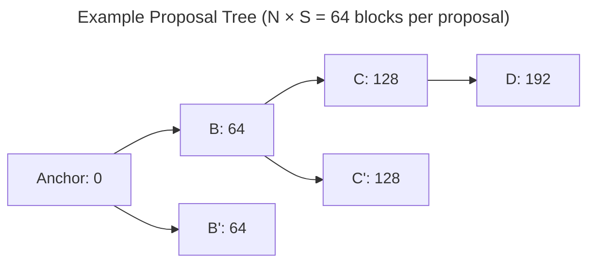
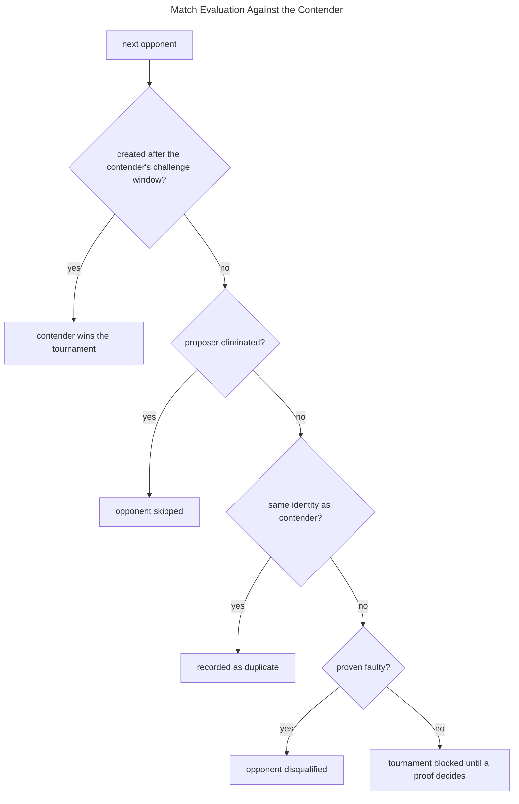
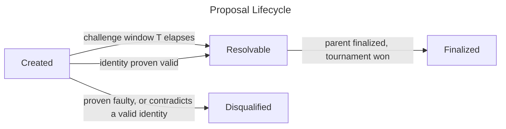
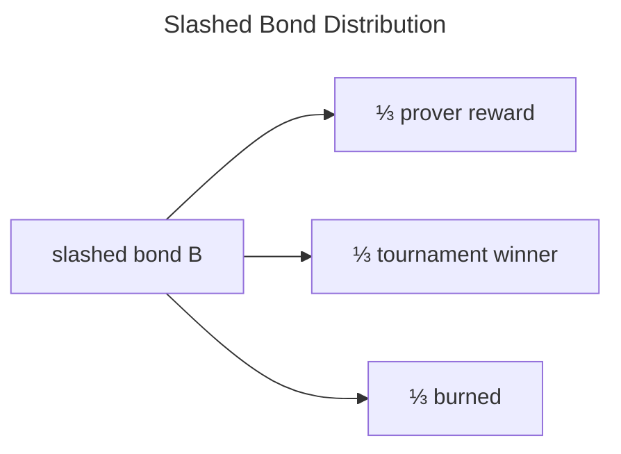

# Sequencing

This chapter is the normative specification of Kailua's sequencing protocol: how the canonical state of a rollup is
advanced through *proposals*, how contradictory proposals compete, and how a proposal becomes finalized.
The key words *must*, *must not*, *should*, and *may* are to be interpreted as requirements on any conforming
implementation.

The rules below define the protocol in the abstract.
The `KailuaTreasury`, `KailuaGame`, and `KailuaTournament` contracts constitute the current *implementation instance*
of these rules on Ethereum, and the [proposer agent](proposer.md) is the reference implementation of the
proposer role.
Implementation notes throughout this chapter map each abstract rule to its current enforcement point, but the abstract
rules — not the contracts — are the source of intended behavior.

## Protocol Parameters

A sequencing deployment is parameterized by the following values, fixed at deployment time:

| Symbol | Name                    | Meaning                                                                     |
|--------|-------------------------|------------------------------------------------------------------------------|
| `N`    | proposal output count   | The number of output commitments each proposal must publish.                |
| `S`    | output block span       | The number of L2 blocks covered by each output commitment.                  |
| `T`    | challenge timeout       | The period during which a proposal remains contestable.                     |
| `B`    | participation bond      | The collateral a proposer must lock before proposing.                       |
| `V, A` | vanguard, advantage     | An optional privileged proposer and the duration of its priority window.    |
| `G, t` | genesis time, block time| The timestamp of the L2 genesis block and the L2 block interval.            |

Each proposal advances the chain by exactly `N × S` blocks.

```admonish info title="Implementation"
These parameters are immutable values of the deployed contract instance: `PROPOSAL_OUTPUT_COUNT`,
`OUTPUT_BLOCK_SPAN`, `MAX_CLOCK_DURATION`, `participationBond` (owner-adjustable), `vanguard`/`vanguardAdvantage`
(owner-assignable), and `GENESIS_TIME_STAMP`/`L2_BLOCK_TIME`. See [deployment parameters](parameters.md).
```

## Proposals

The protocol maintains a tree of proposals rooted at a trusted **anchor**: a starting state assumed valid by all
participants.

<div style="text-align: center;">



</div>

Siblings with different identities — such as `B` and `B'` above — implicitly dispute one another, with no separate
challenge step. The [tournament rules](#tournaments) below determine which child of each parent, here along the path
`Anchor → B → C → D`, may carry finality forward.

A **proposal** extends exactly one parent (the anchor or an earlier proposal) and consists of:

* A **claim**: an output commitment to the rollup state at height `h = h_parent + N × S`.
* **Intermediate commitments**: output commitments at each of the `N − 1` heights
  `h_parent + S, h_parent + 2S, …`, published to a data availability layer such that each individual commitment can
  later be provably read back on the settlement layer. The claim itself serves as the `N`-th commitment.
* A **derivation anchor**: a reference to the settlement-layer (L1) state from which the proposal's rollup data is
  derivable.
* A **duplication counter**: an ordinal distinguishing repeated publications of otherwise identical proposal data.

Publication space not occupied by intermediate commitments (*trailing data*) must be zero-valued.

Every proposal has an **identity**: a binding commitment to its claim together with the entirety of its published
data — intermediate commitments and trailing data alike.
Two proposals with equal identities are **duplicates**: they assert exactly the same state transitions and the
protocol treats them as sharing one fate.

```admonish note
A proposal's identity deliberately excludes its derivation anchor.
Whether a proposal's commitments are correct is independent of which L1 view they are derived from — this is
eventually demonstrated by a [proof](validating.md) against *some* published derivation anchor.
```

```admonish info title="Implementation"
Proposals are `KailuaGame` instances created through the rollup's `DisputeGameFactory`; the anchor is the
`KailuaTreasury` instance. Intermediate commitments are 32-byte output roots reduced to BLS12-381 scalar field
elements (`hash_to_fe`) and published as EIP-4844 blobs — `ceil((N − 1) / 4096)` blobs per proposal — with KZG
openings as the read-back mechanism. The claim is the game's `rootClaim`, the derivation anchor its `l1Head`, and the
identity is `signature = sha256(rootClaim ‖ proposalBlobHashes)`.
```

## Proposal Creation Rules

A conforming implementation must reject any proposal that violates one of the following rules.

**Proposer eligibility:**

1. The proposer must not have been [eliminated](#elimination-and-collateral) at any prior point.
2. The proposer must have at least `B` collateral locked with the protocol at creation time.
3. Successive proposals by the same proposer must strictly increase in height.

**Structural integrity:**

4. Proposals must enter the protocol only through its sanctioned creation path, and be initialized exactly once.
5. A proposal's encoding must be canonical: two encodings of the same proposal data must not be able to coexist as
   distinct proposals.
6. Duplication counters must be assigned sequentially: a proposal with counter `d > 0` is valid only if a proposal
   with identical claim data and counter `d − 1` exists.
7. The proposal's height must equal its parent's height plus exactly `N × S`.
8. All published data the proposal commits to must be available at creation time.

**Tree consistency:**

9. The parent must itself be a proposal known to the protocol (or the anchor).
10. The proposal's identity must still be *viable* in the parent's tournament: an identity proven faulty, or one that
    contradicts an identity proven valid, must not be (re-)introduced.
11. The parent's tournament must not already have produced a finalized successor.

**Timing:**

12. A proposal must not be created before the earliest time its claimed height can exist according to the rollup's
    block schedule: `G + h × t`.
13. If a vanguard `V` is assigned, only `V` may create the *first* child of any parent until the advantage duration
    `A` has elapsed beyond the time given by rule 12. Other proposers may always create counter-proposals to an
    existing first child.

The duplication counter (rules 5–6) exists so that a correct claim can be re-proposed when all prior proposals carrying
it are disqualified — for example, when the original was published by a since-eliminated proposer, or alongside faulty
intermediate commitments (which alter the identity but not the claim).

```admonish check title="What these rules uphold"
* **Constant collateral (rules 1–3).** One bond of `B` backs a proposer's entire chain of proposals, with at most one
  proposal per tournament. An honest proposer's collateral requirement never grows with the number or size of attacks
  against it — the resource-exhaustion resistance described in the
  [introduction](introduction.md#resource-exhaustion).
* **Exhaustive accounting (rules 4–6).** A single creation path and a canonical encoding make the protocol's record of
  children and duplicates complete and unambiguous, so tournament outcomes can be computed from that record alone.
* **A connected, judgeable tree (rules 7–11).** Every proposal attaches at exactly one known parent and height, with
  its full data available for judgement from the moment of creation, and nothing can attach below a decided
  tournament — settled state can never be re-opened.
* **Meaningful clocks (rules 12–13).** A challenge window that opens before the claimed blocks can even exist burns
  dispute time while there is nothing yet to check; rule 12 prevents this, and rule 13 grants the vanguard only a
  bounded head start that can never block counter-proposals to an existing first child.
```

```admonish info title="Implementation"
Rules 1–3 and 13 are enforced by `KailuaTreasury.propose` (`BadAuth`, `IncorrectBondAmount`, `BlockNumberMismatch`,
`VanguardError`); rules 4–12 by `KailuaGame.initialize` (`Blacklisted`/`AlreadyInitialized`/`UnknownGame`,
`BadExtraData` — via a fixed `0x72`-byte calldata length that removes encoding malleability —
`InvalidDuplicationCounter`, `BlockNumberMismatch`, `BlobHashMissing`, `InvalidParent`, `ProvenFaulty`,
`ClaimAlreadyResolved`, `ProposalGapRemaining`).
```

## Tournaments

The children of a proposal compete in a **tournament** to become its unique finalized successor.
The tournament is decided by the following match rules, evaluated over children in order of creation:

1. The earliest child whose identity is still viable (creation rule 10) and whose proposer is not eliminated is the
   current **contender**.
2. Each later child (**opponent**) is compared against the contender:
   * An opponent created after the contender's challenge window (`T` from the contender's creation) had already
     closed is disregarded, and the contender wins the tournament outright. Late counter-proposals cannot re-open a
     settled claim.
   * An opponent from an eliminated proposer is skipped.
   * An opponent with the same identity is a duplicate of the contender and shares its fate.
   * An opponent whose identity was proven faulty is disqualified, and its proposer
     [eliminated](#elimination-and-collateral).
   * An opponent with a different but still-viable identity **blocks the tournament**: a match between two
     contradictory, unproven identities must not be decided by anything other than a [proof](validating.md).
3. If the contender's own identity becomes unviable, the contender and all of its recorded duplicates are
   disqualified — their proposers eliminated — and the contender search resumes from the next child.

<div style="text-align: center;">



</div>

A tournament may be played out incrementally, but its outcome must be a deterministic function of the recorded proof
outcomes, independent of who evaluates it.

```admonish check title="What these rules uphold"
* **Safety without deadlines.** A match between contradictory identities is only ever decided by a proof, and no
  [proof can convict a correct proposal](validating.md#transition-proofs). An honest proposal therefore survives every
  match it is drawn into without its proposer ever having to respond — attackers who flood a tournament with
  contradictions only queue up their own eliminations, at no added cost to the defender (see
  [Sybil identities](introduction.md#sybil-identities)).
* **Bounded delay.** Because opponents arriving after the contender's challenge window are disregarded, an adversary
  cannot keep a settled claim contested by continuously re-proposing against it. Once a correct contender's window
  closes, finality waits only on proofs against the contradictions created inside that window — a workload that
  shrinks with proving power rather than growing with the attacker's persistence (see
  [Withdrawal delay](introduction.md#withdrawal-delay)).
```

### Resolution

A proposal becomes **finalized** — its claim accepted as the canonical rollup state — only when all of the following
hold:

1. Its parent is finalized. Finality proceeds strictly from the anchor outward.
2. Either its full challenge timeout `T` has elapsed since creation, or its identity has been proven valid
   (finality *fast-forward*).
3. It has won its parent's tournament as the surviving contender.

The anchor itself is finalized directly by deployment governance, which is how a new deployment is activated.

<div style="text-align: center;">



</div>

Condition 1 exists because a proposal's correctness is only ever *conditional* on its parent: proofs judge the
transition starting from the parent's claim. Finalizing strictly outward from the anchor turns this chain of
conditional statements into an unconditional one — and gives faults a free cascade: once a proposal is eliminated, its
entire descendant subtree simply never finalizes, without a single proof against any descendant.

```admonish info title="Implementation"
Tournaments are evaluated by `KailuaTournament.pruneChildren` (progress persisted in
`contenderIndex`/`opponentIndex`/`contenderDuplicates`; a viable contradiction reverts with `NotProven`).
Resolution conditions are enforced by `KailuaGame.resolve` (`OutOfOrderResolution`, `ClockNotExpired`/`ProvenFaulty`,
`NotProven`), and anchor finalization by the factory-owner-gated `KailuaTreasury.resolve`.
```

## Elimination and Collateral

**Elimination** permanently disqualifies a proposer:

1. A proposer is eliminated when one of their proposals is disqualified in a tournament match — its identity proven
   faulty, or contradicting a proven-valid identity.
2. Elimination happens at most once per proposer, and only through a tournament of a finalized parent.
3. The eliminated proposer's locked collateral is slashed and split three ways: one share to a prover beneficiary —
   resolved by the [payout precedence](validating.md#payouts-and-permits) — one share to the proposer of the
   tournament's eventual winner, and one share burned.
4. From the offending proposal onward, all of the proposer's proposals are skipped in every tournament, and the
   proposer may never propose again. Proposals made *before* the offending one remain in play.

<div style="text-align: center;">



</div>

Each share of the split serves a distinct purpose: the prover share is the bounty that funds permissionless proving,
so that every fault pays for its own conviction; the winner share compensates the proposer whose correct
counter-proposal kept the chain live while its collateral was locked in the dispute; and the burned share guarantees
that every proven fault carries a strictly positive cost — even a proposer who convicts themselves through colluding
prover and winner identities recovers at most two thirds of their bond.

Honest proposers recover their collateral in full: a proposer who was never eliminated may withdraw their bond once
every tournament containing one of their proposals has produced a finalized successor.

```admonish warning
The one-bond-many-proposals design means a single proven fault forfeits the proposer's entire bond, no matter how many
correct proposals they have in flight. There is no partial slashing.
```

```admonish info title="Implementation"
`KailuaTreasury.eliminate` enforces rule 2 (`Blacklisted`, `NotProposed`, `AlreadyEliminated`) and performs the
1/3 prover / 1/3 winner / 1/3 burn split; the winner's share accrues per-tournament and is credited upon resolution.
Bond recovery is `claimProposerBond`.
```

## The Proposer Role

Any party may act as a proposer.
For the rollup to remain both *safe* (no incorrect state finalizes) and *live* (correct state keeps finalizing), at
least one honest, well-collateralized proposer must exist, and it must behave as follows:

* **Verify before extending.** An honest proposer must validate every observed proposal — claim, each intermediate
  commitment, and the zeroness of trailing data — against its own trusted view of the rollup, and extend only the
  *canonical tip*: the highest correct proposal made by a non-eliminated proposer.
* **Propose only settled data.** Proposals must be assembled exclusively from L2 data the proposer's view considers
  final, so published commitments can never be invalidated by an L2 reorg.
* **Respect timing.** The proposer must wait out rule 12's minimum creation time, and — when it is not the vanguard —
  rule 13's advantage window, rather than submit proposals that will be rejected.
* **Handle duplicates deliberately.** When its intended claim has already been proposed, the proposer must locate the
  lowest unused duplication counter, skipping duplicates that are faulty or authored by eliminated proposers — and
  must *not* re-propose at all if a correct duplicate by a non-eliminated proposer is already live, since doing so
  locks additional collateral without changing any outcome.
* **Maintain collateral.** The proposer must ensure its locked collateral meets `B` (topping up exactly the shortfall)
  before proposing, and must keep its wallet funded — an unfunded honest proposer is a liveness failure.
* **Drive resolution.** The proposer should finalize resolvable proposals along the canonical chain: waiting out
  timeouts (or acting on recorded validity proofs), advancing tournament evaluation, and resolving the surviving
  successor. Where evaluation is blocked by an undecided match, resolution must wait for a [proof](validating.md).
* **Monitor its own standing.** A proposer observing its own elimination must alert its operator: its key is
  compromised or its data sources fed it incorrect outputs. It must also verify it is targeting the deployment's
  current implementation instance before proposing.

```admonish info title="Implementation"
`kailua-cli propose` implements this role: it validates all proposals against `op-node` output roots, gates proposals
on the finalized L2 head, performs the duplication-counter search and honest-duplicate skip, tops up bond shortfalls
in the propose call, issues incremental tournament-evaluation transactions in bounded batches, and raises telemetry
alarms upon self-elimination. See [Proposer](proposer.md) for operation.
```

```admonish danger
A proposer's safety reduces to the integrity of its rollup view.
An honest implementation connected to a divergent or lagging `op-node` will publish provably faulty proposals and
forfeit its collateral; the protocol cannot distinguish it from a malicious proposer.
```
