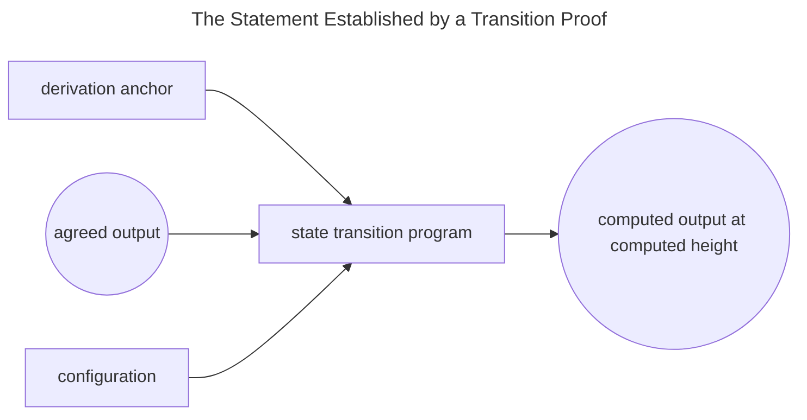
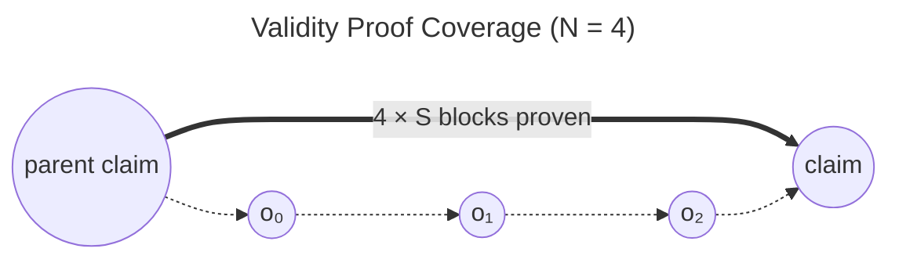
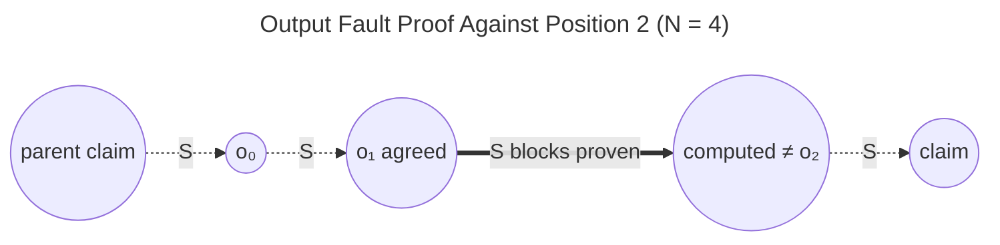
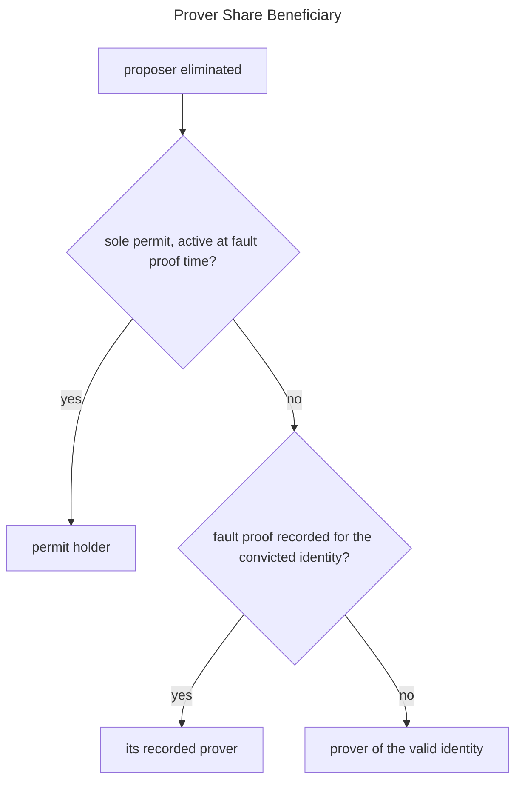

# Validating

This chapter is the normative specification of Kailua's validation protocol: how disputes between contradictory
[sequencing proposals](sequencing.md) are settled by proofs, and how proposals are proven valid ahead of their
challenge timeout.
As in the [previous chapter](sequencing.md), the key words *must*, *must not*, *should*, and *may* denote
requirements on any conforming implementation, and the rules below define the protocol in the abstract — with the
`KailuaTournament` and `KailuaVerifier` contracts as the current implementation instance and the
[validator agent](validator.md) as the reference implementation of the validator role.

Proof submission is **permissionless** and **non-interactive**: any party may settle any dispute with a single
submission, and proofs attach to a proposal's *identity* rather than to any individual proposal instance.

## Transition Proofs

The foundation of validation is the **transition proof**: a succinct, verifiable attestation of one application of
the rollup's state transition function. A transition proof establishes a claim tuple:

| Component           | Meaning                                                                                       |
|---------------------|-----------------------------------------------------------------------------------------------|
| beneficiary         | The party to be credited for the proof.                                                       |
| precondition        | An optional commitment binding the proof to externally published data (see validity proofs).  |
| derivation anchor   | The settlement-layer (L1) state from which all rollup inputs were derived.                    |
| agreed output       | The starting output commitment, assumed correct.                                              |
| computed output     | The output commitment reached by applying the state transition function.                      |
| computed height     | The rollup height of the computed output.                                                     |
| configuration       | A binding commitment to the rollup configuration under which the transition was computed.     |
| program             | A binding commitment to the state transition program itself.                                  |

A conforming verification procedure must accept a claim tuple only if *starting from the agreed output, deriving the
rollup using only data reachable from the derivation anchor yields the computed output at the computed height, under
the committed configuration and program*.

<div style="text-align: center;">



</div>

The protocol imposes two constraints on how claim tuples may be formed:

1. The derivation anchor must be one committed by a proposal registered in the protocol. Provers cannot introduce an
   arbitrary L1 context; they may only derive from a view that some proposal has staked on.
2. The computed height must equal the parent proposal's height plus a whole number of output-span (`S`) steps, so
   proofs always align with the commitment schedule of the proposals they judge.

```admonish note
There is no separate "fault program" and "validity program": the state transition program always computes the
*correct* output.
A fault is established by showing the proven-correct output *differs* from what a proposal published; validity is
established by showing it *equals* the proposal's claim.
Fault proofs exhibiting agreement are rejected ([output fault rule 3](#output-fault-proofs)) — a proof can never
convict a correct proposal.
```

```admonish info title="Implementation"
Transition proofs are RISC Zero zkVM receipts for the Kailua FPVM program (a Kona-based derivation client).
The claim tuple is the FPVM's journal; `KailuaVerifier.verify` reconstructs the expected journal — substituting its
immutable `ROLLUP_CONFIG_HASH` and `FPVM_IMAGE_ID` for the configuration and program commitments — and delegates seal
verification to the deployed RISC Zero verifier contract. Constraint 1 is enforced by requiring the anchor to be the
`l1Head` of a treasury-registered proposal (`UnknownGame`); constraint 2 by having the tournament contract itself
compute the claim height.
```

## Proof Classes

Three classes of proof can be recorded against a child identity in a tournament:

| Proof class  | Needs a transition proof? | Establishes                                                          |
|--------------|---------------------------|-----------------------------------------------------------------------|
| Validity     | Yes                       | Every commitment made by the proposal is correct.                    |
| Output fault | Yes                       | One published output commitment contradicts the derivable state.     |
| Trail fault  | No                        | The proposal's published data violates the required format.          |

For every proof class, a conforming implementation must enforce:

1. Proofs may be accepted for or against a child only until its parent's tournament produces a finalized successor.
2. At most one proof outcome is ever recorded per identity; the outcome, the prover, and the proving time are recorded
   permanently.
3. Proof submission must remain open to any party for as long as rule 1 permits.

```admonish check title="What these rules uphold"
* **Sybil resistance.** Because proofs attach to identities and are recorded exactly once, duplicating a faulty
  proposal multiplies the attacker's locked collateral without adding a single unit of proving work for the defense —
  one proof settles every copy (see [Sybil identities](introduction.md#sybil-identities)).
* **No proving deadlines.** The challenge timeout limits only the *creation* of contradictions
  ([tournaments](sequencing.md#tournaments)), never their resolution (rule 3): however large the attack, each pending
  match waits indefinitely for its proof, so proving power determines how fast disputes settle — never whether they
  settle correctly (see [Resource exhaustion](introduction.md#resource-exhaustion)).
* **Permissionless settlement.** Any party — not only the disputants — can supply the deciding proof, so settlement
  liveness does not rest on the parties whose collateral is at stake.
```

```admonish info title="Implementation"
Enforced by `KailuaTournament` for all classes: `GameNotInProgress`, `ClaimAlreadyResolved`, and `AlreadyProven`; the
recorded outcome is `proofStatus[signature]` with `prover` and `provenAt`, announced by the `Proven` event.
```

### Validity Proofs

A **validity proof** vouches for a child's entire commitment set in one step. It must consist of a transition proof
whose agreed output is the parent's claim and whose computed output is the child's claim, at the child's full height —
covering all `N × S` blocks.

<div style="text-align: center;">



</div>

When a proposal publishes more than one output commitment (`N > 1`), the transition proof must additionally commit —
through its precondition — to the equivalence of the derived intermediate outputs and the proposal's published
intermediate commitments. A validity proof thereby vouches for the published data, not merely the final claim.

Recording a validity proof makes the proven identity the tournament's unique **valid identity**, with these effects:

* Every other child identity in the tournament immediately becomes unviable; contradictory siblings are disqualified
  by the tournament rules — their proposers eliminated — without individual fault proofs.
* No proposal contradicting the valid identity may be created from that point on (creation rule 10).
* Children bearing the valid identity no longer wait out the challenge timeout: they finalize as soon as their parent
  is finalized — the finality *fast-forward* of [resolution](sequencing.md#resolution) rule 2.

```admonish info title="Implementation"
`KailuaTournament.proveValidity` stores `validChildSignature` and passes the parent claim, child claim, and full
output count to verification. The precondition is
`sha256(parent height ‖ N ‖ S ‖ blobsHash)` over the child's blob hashes; the FPVM enforces it by checking each
derived intermediate output against the corresponding blob field element.
```

### Output Fault Proofs

An **output fault proof** convicts a child by exhibiting a single divergent output commitment.
For a disputed commitment at position `i` (where the proposal's commitments occupy positions `0` through `N − 1`, the
claim being the last), a conforming implementation must require:

1. `i` addresses one of the proposal's `N` output commitments.
2. **Agreed output.** For `i = 0`, the transition proof's agreed output must be the parent's claim. For `i > 0`, the
   submitter must demonstrate — via the data availability layer's read-back mechanism — that the *proposal itself*
   published the agreed output as its commitment at position `i − 1`.
3. **Divergence.** The proven computed output must contradict the proposal's commitment at position `i`: for the final
   position, it must differ from the proposal's claim; for intermediate positions, the submitter must demonstrate what
   the proposal published at position `i` and that it differs from the computed output. Proofs exhibiting agreement
   must be rejected.
4. The transition proof must cover exactly the `S` blocks from position `i − 1` (or the parent claim) to position `i`,
   with no precondition.

<div style="text-align: center;">



</div>

Rule 2 is what makes disputes cheap: because the agreed output is read from the faulty proposal's *own* publication, a
fault proof only ever derives the `S` blocks between two adjacent commitments — never the whole proposal.
The choice of `N` and `S` thus bounds the worst-case proving work for any single dispute, as illustrated in the
[design overview](design.md#sequencing).
Note that the agreed output need not be *correct* — position `i − 1` may itself be faulty. The proof only establishes
that the proposal is inconsistent with its own published data at position `i`, which suffices: whatever the truth,
an identity that diverges from the derivable state at *any* position is not the correct one.

A recorded fault makes the identity permanently unviable: the proposal and all duplicates can never finalize, and the
tournament rules disqualify them, eliminating their proposers.

```admonish info title="Implementation"
`KailuaTournament.proveOutputFault` (`InvalidDisputedClaimIndex`, `NoConflict`). Read-back of published commitments is
by KZG opening against the blob hashes fixed at creation, checked with the point-evaluation precompile
(`bad acceptedOutput kzg` / `bad proposedOutput kzg`); comparisons use the field-element reduction of output roots,
and the precompile inherently rejects non-canonical field elements.
```

### Trail Fault Proofs

A **trail fault proof** convicts a child of violating the publication format, and requires no transition proof: the
submitter demonstrates, via the read-back mechanism, that the proposal published a non-zero value in its trailing
(zero-padding) region.
Implementations must reject trail fault claims that address the commitment region or exhibit a zero value.
A recorded trail fault has the same effect as an output fault.

```admonish check title="Why trail faults exist"
Trail faults close the last gap in decidability. A proposal whose `N` output commitments are all correct but whose
trailing data is non-zero still contradicts the honest identity — yet no output fault proof can convict it (there is
no divergence to exhibit), and no validity proof can vouch for it (transition proofs enforce zero trailing data
through their precondition). Without trail faults, such an identity would block its tournament forever. With them, the
protocol upholds the invariant that **every pair of contradictory identities is decidable by some proof**: two
identities can only differ in an output commitment (an output fault against at least one) or in the padding (a trail
fault). Equivalently, the zero-padding rule gives correct data exactly one identity, so honest proposals always converge on a
single identity that shares one proof and one fate.
```

```admonish info title="Implementation"
`KailuaTournament.proveTrailFault` (`InvalidDisputedClaimIndex`, `NoConflict`, `InvalidDataRemainder` — the disputed
position must fall in the final blob, which loses no generality since earlier blobs are fully packed with
commitments).
```

## Payouts and Permits

When a proposer is eliminated, the prover's share of the slashed bond is paid to a beneficiary resolved in this order
of precedence:

1. The holder of the *sole* [fault proving permit](design.md#fault-proving-permits) for the convicted identity — if
   exactly one permit was ever acquired for it, and that permit was active when the convicting fault proof was
   recorded.
2. The recorded prover of the convicted identity.
3. The recorded prover of the tournament's valid identity, when elimination resulted from a validity proof.

<div style="text-align: center;">



</div>

Permits give provers an exclusive reward window in exchange for locked collateral. A conforming permit mechanism must
enforce:

1. Permits may only be acquired for identities that are still viable.
2. The permit collateral must cover at least twice the prover's elimination share, so that abandoning a permit costs
   more than the reward it protects.
3. Permit issuance capacity must be bounded by expiry: at most one more permit than twice the number of
   already-expired permits may exist for an identity at any time.
4. A permit becomes active only after its activation delay, expires after its total duration, and its collateral is
   returned when released after a proof recorded within its lifetime. Holders whose permits expired before the proof
   forfeit their collateral to the holders active at proving time.

```admonish check title="What the permit collateral scheme upholds"
* **Constant cost to participate, exponential cost to monopolize.** Every permit costs the same fixed collateral
  (rule 2) no matter how many were issued before it, so entering the reward race never grows more expensive. Capacity,
  however, compounds through expiry (rule 3): one permit may exist initially, three once it expires, seven once those
  do, and so on — and every expired permit forfeits its collateral (rule 4). An actor attempting to hold *all* permits
  for a fault must therefore burn collateral that doubles with each expiry cycle, while any competitor can always
  claim a newly opened slot at the constant price — squatting on exclusivity to stall honest proving becomes
  exponentially expensive (see [Denial-of-Service](introduction.md#denial-of-service)).
* **Every active prover is paid, despite a single proposer bond.** The eliminated proposer posted one bond, whose
  prover share can reward only one beneficiary — yet expiries may leave several permits simultaneously active when
  the fault proof lands. The scheme makes these payouts self-funding: each holder active at proving time recovers its
  own collateral *plus* an equal share of the collateral forfeited by expired permits. Because active permits can
  outnumber expired ones by at most one (rule 3), and each expired permit forfeited twice the prover share (rule 2),
  this pool pays every active holder at least a full prover reward — funded by the forfeited collateral alone, not
  the bond. The sole-permit case needs no pool: its holder is paid the bond's prover share directly, per the
  precedence above.
```

```admonish info title="Implementation"
`KailuaVerifier.acquireFaultProofPermit` (`ProvenFaulty`, `IncorrectBondAmount`, `ClockNotExpired`) and
`releaseFaultProofPermit` (`NotProven`), parameterized by the immutable `PERMIT_DELAY` and `PERMIT_DURATION`;
beneficiary resolution is `getPayoutRecipient` in `KailuaTournament`.
```

## The Validator Role

Any party may act as a validator.
The protocol's safety argument requires that every dispute eventually receives a deciding proof; for this, at least
one honest validator must exist and behave as follows:

* **Prove only provable statements.** A validator must confirm that the deployment's committed program and
  configuration are ones it can execute and vouch for, before dedicating any resources to the deployment.
* **Judge from a trusted view.** A validator must assess every observed proposal — claim, each intermediate
  commitment, and trailing data — against its own trusted view of the rollup, and must defer judgement on any
  proposal whose height its view has not yet settled. It must never derive a fault verdict from unverifiable data.
* **Target the first divergence.** For an incorrect proposal, the validator should convict at the cheapest sufficient
  point: a format violation (trail fault) needs no transition proof and takes precedence; otherwise the *earliest*
  divergent commitment, so the transition proof spans a single `S`-block step whose agreed output is still shared
  with the canonical chain.
* **Avoid redundant work.** A validator should prove each identity at most once across all duplicates, skip disputes
  already settled (re-checking immediately before submission, since other validators race for the same
  disputes), decline to fault-prove when a validity proof already settles the tournament, and de-correlate its
  proving schedule from other validators (e.g., by randomized delay) where redundancy is not desired.
* **Use registered derivation anchors.** A validator must construct claim tuples only over registered derivation
  anchors ([constraint 1](#transition-proofs)): beginning with the disputed proposal's own, and — if its L1 view
  proves insufficient to derive the disputed span — retrying with successively later ones.
* **Verify before submitting.** A validator should verify its own proofs and cross-check every claim-tuple component
  and read-back opening against the settlement layer before submission, and re-buffer rather than discard proofs
  whose submission fails.
* **Fast-forward when appropriate.** A validator may prove the validity of correct proposals to accelerate finality.
  On deployments where `N = 1`, it should respond to any conflict with a validity proof of the correct sibling: a
  single such proof both accelerates the honest proposal and eliminates every contradiction, and there is no cheaper
  intermediate fault to exhibit.
* **Honor the permit protocol.** A validator using permits must acquire them only when capacity is available, wait
  for activation before submitting the associated proof so the exclusive window applies, and release them after the
  proof is recorded to reclaim collateral.

```admonish info title="Implementation"
`kailua-cli validate` implements this role: it refuses deployments whose `FPVM_IMAGE_ID` is not baked into its
binary, gates all judgement on `op-node` finality, classifies faults as trail-first-then-earliest-output, re-checks
`proofStatus`/`isViableSignature` at queueing, dispatch, and submission time, retries proof generation across
successive proposal `l1Head`s, locally verifies receipts and dry-runs KZG openings before spending gas, and manages
permits per the configured policy. See [Validator](validator.md) for operation.
```

```admonish danger
A validator's effectiveness reduces to the integrity of its rollup view (`op-node` and archive `op-geth`).
The proof system prevents a misinformed validator from harming the protocol — incorrect verdicts yield unprovable
statements or rejected submissions — but not from wasting proving effort or failing to convict real faults.
```
